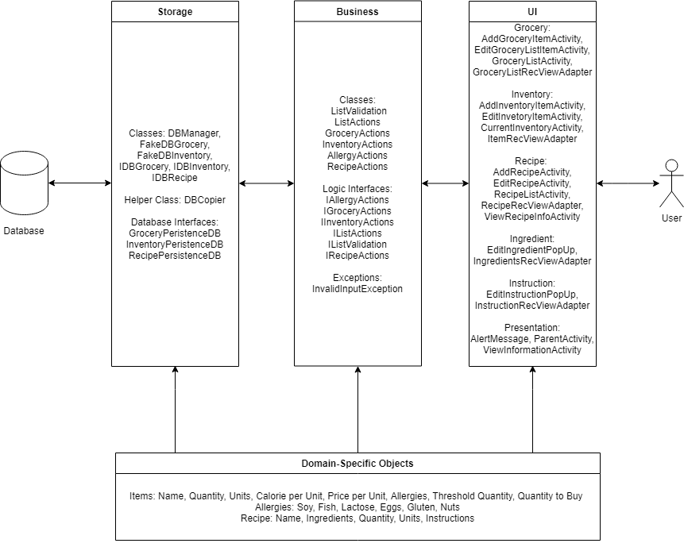

# SmartKitchen Group 10

# SmartKitchen Vision Statement

SmartKitchen is a food inventory and grocery list manager for Android devices. This application will assist users in managing and tracking the food they currently have in their kitchen. In addition to tracking their kitchen's current inventory, the application will also assist the user in their next shopping trip by providing a simple, easy to use grocery list feature that will automatically add items as they run low in the user’s current inventory. The application aims to simplify and streamline average, day-to-day kitchen routines by providing users with functions to keep track of their current pantry, as well as options for a better and easier grocery shopping experience and recipe management.
 
SmartKitchen will have features that focus on assisting people in managing their inventory easily. The user will be able to add, remove and edit items with ease. The users will be able to set thresholds for when items should automatically be added to their grocery list, manage what quantities of an item they want to buy, and jot down any other information they might want about an item. The application will help users in managing their expenses by tracking the price of each individual item, keeping a running total of the current price of their grocery list, and alerting users when it might be time to go shopping. This will save a ton of time for users by removing the need to write down an entire list from scratch. In addition, users will be able to use the application as a virtual cookbook, enabling them to write, copy, and share recipes to other users. With all these features in one place, a user can easily check a recipe, determine if they have the ingredients they need, and if not; directly add them to the cart. 

Users who are keeping track of their diet will also see use in the application. The application will have a feature of adding nutritional facts on its items (e.g. calories, fat, etc.) which may be used by the user when they are keeping track of their nutrient intake. This health information can also be found in the recipes that the users create, making health conscious eating simple and easy to manage.
 
SmartKitchen targets users who frequent the kitchen and make food on a regular basis. It is not focused on satisfying the needs of huge commercial establishments such as big restaurants. However, small scale restaurants may find benefit in using the application as it can assist them in keeping track of their inventory. For regular users, the application will be useful because it will provide an easier way to manage their pantry and save time when planning what to cook for the day or the week. SmartKitchen will be the centralized hub for any productive kitchen.
 
The main success criteria that we are looking at is the number of users that are accessing the app. Another measure of success is the number of total recipes that are being added to the app. This measure can give us an indication of the current state of the app’s progression. The number of times recipes are used and the total number of items that were added or removed from the pantry is another measure, as it lets us know that the users are using the app's features frequently. 

### Branching Strategy

The branching strategy for the iteration can be found [here](branching_strategy.md).

### Architecture

### Worksheet
The worksheet to iteration 1 can be found [here](worksheet.md).
The worksheet to the current iteration can be found [here](Worksheet2.md).