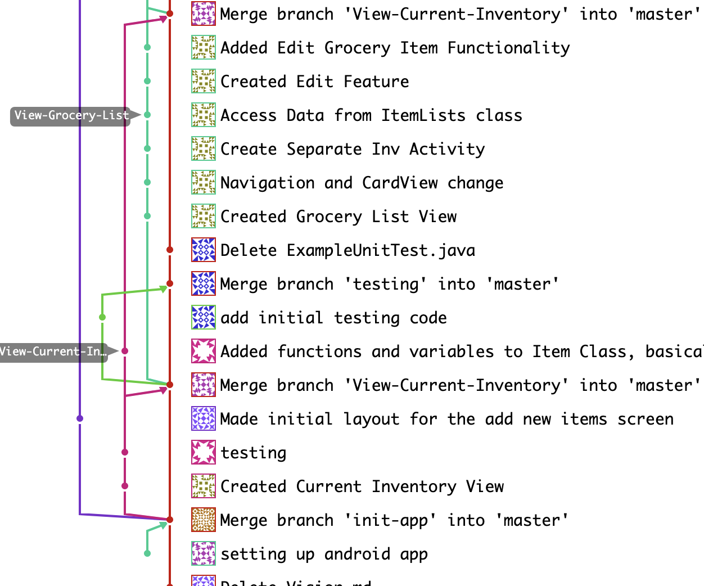

# Iteration 1 Worksheet

## Adding a feature

Feature: **Maintain a Grocery List**
One of the features we added in our app is being able to maintain a grocery list. This feature overlaps with the other feature named **Maintain an Inventory of Food Currently in the Fridge** so there may be a couple of overlaps between implementation of the two features.  The feature is found [here](https://code.cs.umanitoba.ca/3350-winter-2021-a01/refrigator-tracker-group-10/-/issues/2).
The user stories are as follows:
* As a user, I should be able to view the items in the grocery list.
* As a user, I should be able to remove items from the grocery list.
* As a user, I should be able to add items to the grocery list.
 
The merge requests that were used for this feature are as follows:
* [Merge Request 4](https://code.cs.umanitoba.ca/3350-winter-2021-a01/refrigator-tracker-group-10/-/merge_requests/4)
* [Merge Request 9](https://code.cs.umanitoba.ca/3350-winter-2021-a01/refrigator-tracker-group-10/-/merge_requests/9)
* [Merge Request 14](https://code.cs.umanitoba.ca/3350-winter-2021-a01/refrigator-tracker-group-10/-/merge_requests/14)
* [Merge Request 5](https://code.cs.umanitoba.ca/3350-winter-2021-a01/refrigator-tracker-group-10/-/merge_requests/5)
 
The associated tests can be found [here](https://code.cs.umanitoba.ca/3350-winter-2021-a01/refrigator-tracker-group-10/-/tree/master/app/src/test/java/com/smartkitchen/tests).
 
The merge commits that were used to complete the feature is found [here](https://code.cs.umanitoba.ca/3350-winter-2021-a01/refrigator-tracker-group-10/-/merge_requests/14/commits).

## Exceptional code

[Here](https://code.cs.umanitoba.ca/3350-winter-2021-a01/refrigator-tracker-group-10/-/blob/master/app/src/test/java/com/smartkitchen/tests/ListValidationTest.java) is the link to test exceptional code. This exception is handled because we do not want the users to be able to add items to their lists with the string for name and unit left blank, and quantity set to 0 or less. So in case something of that nature is attempted, we throw an exception. We do not show a pop-up warning with the error message at this point however that will be added in the later iterations. The exception does not let any invalid entries enter either list.

## Branching

Our branching strategy is mentioned in our README file. This can be found [here](README.md).

Following that strategy, we can observe in the screenshot below that the View-Current-Inventory branch is created as a separate branch to implement the feature, worked on until its completion, and then merged back to the master branch.

## SOLID

Group 11 had a SOLID Violation in their code where they had a class in UI folder dealing with deep logic which was a violation of Single-responsibility principle. The issue was created and can be found [here](https://code.cs.umanitoba.ca/3350-winter-2021-a01/your-internet-neighbours-group-11/-/issues/31). The relevant commit for that issue is [10469357](https://code.cs.umanitoba.ca/3350-winter-2021-a01/your-internet-neighbours-group-11/-/commit/10469357ee34726c440ac245c01a6888b1784ccb).

## Agile Planning

We were able to wrap up all of our stories except for one in this iteration. This story can be found [here](https://code.cs.umanitoba.ca/3350-winter-2021-a01/refrigator-tracker-group-10/-/issues/22). This issue has been moved to iteration 2, and can be found under that milestone on GitLab.

We did change the way we handle thresholds. The thresholds were initially supposed to be a predetermined value, where if the quantity of an item in the current inventory drops below 20%, it would be added to the grocery list automatically. Instead, we changed our plan and let the user decide the quantity they think is the minimum and whenever the quanity dips below that number, the equivalent amount gets added to the grocery list. [This](https://code.cs.umanitoba.ca/3350-winter-2021-a01/refrigator-tracker-group-10/-/issues/21) is the story relevant to that.
